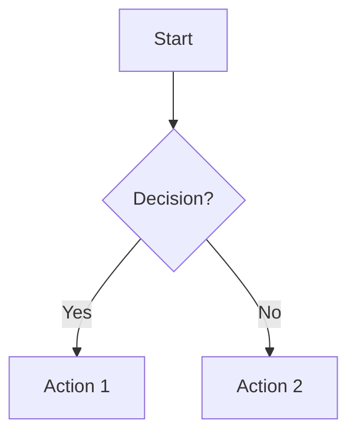

# Stella UX/UI Flow Diagrams

This directory contains Mermaid diagrams that visualize user flows and application navigation for the Stella Document OCR SaaS platform.

## Purpose

- **Flows**: Document app navigation, user journeys, and key processes
- **UX Alignment**: Provide a shared reference for consistent flows across design and development
- **Synchronization**: Keep diagrams updated when significant user flows or routes change

---

## Current Diagrams

| File | Purpose | Status |
|------|---------|--------|
| `app-flow.md` | High-level app navigation (all routes and entry points) | ✅ Complete |
| `quick-start-wizard-flow.md` | Detailed Quick Start wizard user journey (6 steps) | ✅ Complete |

---

## Diagram Format

All diagrams use **Mermaid syntax** within markdown files (`.md`). This allows:
- Direct rendering on GitHub
- Compatibility with VS Code and other editors with Mermaid support
- Easy version control and collaboration

---

## Quick Reference

### Viewing Diagrams
- **GitHub**: Diagrams render automatically in markdown preview
- **VS Code**: Install "Markdown Preview Mermaid Support" extension
- **Online**: Copy/paste code blocks to [mermaid.live](https://mermaid.live) for editing

### Creating New Diagrams
1. Create a new `.md` file in this directory
2. Use descriptive filename (e.g., `workflow-editor-flow.md`)
3. Add Mermaid code blocks with proper syntax
4. Commit and push to repository
5. Reference from `docs/RULES.md` or README if representing primary flows

---

## Mermaid Syntax Examples

### Basic Flowchart (Left-to-Right)

### Flowchart with Decision

---

## Color Palette (Stella Theme)

Diagrams use the Stella monochrome teal color palette for consistency:

| Color | Hex | Usage in Diagrams |
|-------|-----|-------------------|
| **Navy Darkest** | `#07464C` | Borders, text |
| **Navy Dark** | `#0B6873` | Final destinations |
| **Primary** | `#12AEBF` | Key pages |
| **Primary Medium** | `#4AB8C8` | Primary flow steps |
| **Primary Light** | `#71CED9` | Secondary elements |
| **Primary Lighter** | `#A0DFE5` | Decision points |
| **Light Grey** | `#DDDDDD` | Error states |
| **Lightest Grey** | `#F0EFEF` | Alerts/warnings |

---

## Maintenance Guidelines

### When to Update Diagrams
- Route changes or additions
- New user flows introduced
- Navigation structure modifications
- Significant UX changes

### Best Practices
- One logical flow per file (or multiple with clear sections)
- Descriptive filenames reflecting content
- Include notes section explaining diagram context
- Update "Last Updated" date when modified
- Cross-reference related diagrams

---

## Resources

- **Mermaid Documentation**: [mermaid.js.org](https://mermaid.js.org/)
- **Live Editor**: [mermaid.live](https://mermaid.live)
- **Syntax Cheat Sheet**: [Mermaid Flowchart Docs](https://mermaid.js.org/syntax/flowchart.html)

---

**Last Updated:** 2026-01-31
**Maintainer:** Design & Engineering Team
