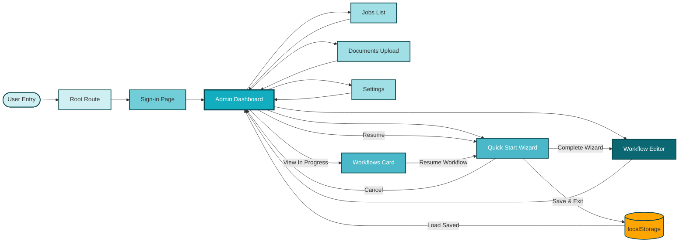

# Stella App Flow - High-Level Navigation

This diagram visualizes the complete application navigation structure, including all primary pages and key user journeys.

## Purpose
- Documents main application routes and entry points
- Shows navigation relationships between pages
- Illustrates the Quick Start wizard entry and completion flow

---

## Main Application Flow

---

## Navigation Notes

### Entry Points
- **Root (/)**: Automatically redirects to `/login`
- **Login Page**: First interaction point for all users

### Dashboard Hub
- **Admin Dashboard** serves as the central navigation hub
- All primary pages are accessible from the dashboard navigation bar
- "Quick Start" button provides prominent access to the wizard

### Quick Start Wizard Flow
- **Entry**: Accessed via "Quick Start" button on dashboard or "Resume" from Workflows Card
- **Completion**: Redirects to Workflow Editor (`/workflows`)
- **Save & Exit**: Saves workflow to localStorage and returns user to Dashboard
- **Cancel**: Returns to Dashboard (progress lost)
- **Resume**: Loads saved workflow data and returns user to last completed step

### Workflow Management
- **Workflows Card**: Displays all in-progress and completed workflows on Dashboard
- **localStorage**: Stores workflow data including: ID, name, company info, current step, status
- **Multiple Workflows**: Administrators can create and manage multiple workflows simultaneously
- **Edit Name**: Workflow names can be edited directly from the Workflows Card

### Return Navigation
- All pages include navigation back to Dashboard
- Workflow Editor is accessible from both Dashboard and Quick Start completion

---

## Route Summary

| Route | Page | Access From |
|-------|------|-------------|
| `/` | Redirect | Entry point → `/login` |
| `/login` | Sign-in Page | Root redirect |
| `/dashboard` | Admin Dashboard | Login success, all page returns |
| `/workflows` | Workflow Editor | Dashboard, Quick Start completion |
| `/jobs` | Jobs List | Dashboard |
| `/documents` | Documents Upload | Dashboard |
| `/settings` | Settings | Dashboard |
| `/quick-start` | Quick Start Wizard | Dashboard (Quick Start button) |

---

## Color Legend
- **Teal Shades**: Primary user flow pages (Dashboard, Quick Start, Workflow Editor)
- **Light Teal**: Secondary pages (Jobs, Documents, Settings)
- **Lightest Teal**: Entry/start states

---

**Last Updated:** 2026-02-02
**Related Diagrams:** `quick-start-wizard-flow.md`
