# Quick Start Wizard - User Journey Flow

This diagram documents the complete user journey through the 6-step Quick Start Wizard, including all navigation paths, validation logic, and error handling.

## Purpose
- Visualize the step-by-step progression through wizard
- Document navigation options (Next, Back, Skip, Cancel, Save & Exit)
- Illustrate validation and error handling flows
- Show final completion and routing logic

---

## Quick Start Wizard User Journey

```mermaid
flowchart LR
    Entry([Quick Start Entry]) --> Step1[Step 1: Company Info<br/>13 fields + country search]

    Step1 --> |Next| V1{Valid?}
    V1 --> |No - Validation Error| E1[Show Inline Errors]
    E1 --> Step1
    V1 --> |Yes| Step2[Step 2: Template Selection<br/>5 templates with preview]
    V1 --> |Duplicate Company| E2[Error: Company Exists]
    E2 --> Step1

    Step2 --> |Next| V2{Valid?}
    V2 --> |No - Validation Error| E3[Show Inline Errors]
    E3 --> Step2
    V2 --> |Yes| Step3[Step 3: Document Types<br/>7 types × 5 file formats]
    Step2 --> |Back| Step1

    Step3 --> |Next| V3{Valid?}
    V3 --> |No - Validation Error| E4[Show Inline Errors]
    E4 --> Step3
    V3 --> |Yes| Step4[Step 4: Business Rules<br/>Accordion + code editor]
    Step3 --> |Back| Step2
    Step3 --> |Skip| A1[Alert: Missing Fields]
    A1 --> |Proceed Anyway| Step4
    A1 --> |Go Back| Step3

    Step4 --> |Next| V4{Valid?}
    V4 --> |No - Validation Error| E5[Show Inline Errors]
    E5 --> Step4
    V4 --> |Yes| Step5[Step 5: Volume Expectations<br/>Dynamic LOB sections]
    Step4 --> |Back| Step3
    Step4 --> |Skip| A2[Alert: Missing Fields]
    A2 --> |Proceed Anyway| Step5
    A2 --> |Go Back| Step4

    Step5 --> |Next| V5{Valid?}
    V5 --> |No - Validation Error| E6[Show Inline Errors]
    E6 --> Step5
    V5 --> |Yes| Step6[Step 6: Output Format<br/>Existing fields]
    Step5 --> |Back| Step4
    Step5 --> |Skip| A3[Alert: Missing Fields]
    A3 --> |Proceed Anyway| Step6
    A3 --> |Go Back| Step5

    Step6 --> |Next| V6{Valid?}
    V6 --> |No - Validation Error| E7[Show Inline Errors]
    E7 --> Step6
    V6 --> |Yes| Confirmation[Confirmation Screen<br/>Summary of all entries]
    Step6 --> |Back| Step5
    Step6 --> |Skip| A4[Alert: Missing Fields]
    A4 --> |Proceed Anyway| Confirmation
    A4 --> |Go Back| Step6

    Confirmation --> |Complete| WorkflowEditor([Workflow Editor<br/>/workflows])

    Step1 --> |Cancel| CD1{Confirm Cancel?}
    Step2 --> |Cancel| CD1
    Step3 --> |Cancel| CD1
    Step4 --> |Cancel| CD1
    Step5 --> |Cancel| CD1
    Step6 --> |Cancel| CD1
    CD1 --> |Dialog: Yes| Dashboard1([Dashboard<br/>Data Lost])
    CD1 --> |Dialog: No| Return1[Return to Current Step]

    Step1 --> |Save & Exit| Save1[Save Progress to DB]
    Step2 --> |Save & Exit| Save1
    Step3 --> |Save & Exit| Save1
    Step4 --> |Save & Exit| Save1
    Step5 --> |Save & Exit| Save1
    Step6 --> |Save & Exit| Save1
    Save1 --> Dashboard2([Dashboard<br/>Progress Saved])

    Step1 -.-> |Session Timeout| Timeout[Timeout Modal]
    Step2 -.-> |Session Timeout| Timeout
    Step3 -.-> |Session Timeout| Timeout
    Step4 -.-> |Session Timeout| Timeout
    Step5 -.-> |Session Timeout| Timeout
    Step6 -.-> |Session Timeout| Timeout
    Timeout --> Login([Login Page])

    style Entry fill:#D0EFF2,stroke:#07464C,stroke-width:2px
    style Step1 fill:#4AB8C8,stroke:#07464C,stroke-width:2px,color:#fff
    style Step2 fill:#4AB8C8,stroke:#07464C,stroke-width:2px,color:#fff
    style Step3 fill:#4AB8C8,stroke:#07464C,stroke-width:2px,color:#fff
    style Step4 fill:#4AB8C8,stroke:#07464C,stroke-width:2px,color:#fff
    style Step5 fill:#4AB8C8,stroke:#07464C,stroke-width:2px,color:#fff
    style Step6 fill:#4AB8C8,stroke:#07464C,stroke-width:2px,color:#fff
    style Confirmation fill:#12AEBF,stroke:#07464C,stroke-width:3px,color:#fff
    style WorkflowEditor fill:#0B6873,stroke:#07464C,stroke-width:3px,color:#fff
    style Dashboard1 fill:#12AEBF,stroke:#07464C,stroke-width:2px,color:#fff
    style Dashboard2 fill:#12AEBF,stroke:#07464C,stroke-width:2px,color:#fff
    style Login fill:#71CED9,stroke:#07464C,stroke-width:2px
    style E1 fill:#DDDDDD,stroke:#07464C,stroke-width:1px
    style E2 fill:#DDDDDD,stroke:#07464C,stroke-width:1px
    style E3 fill:#DDDDDD,stroke:#07464C,stroke-width:1px
    style E4 fill:#DDDDDD,stroke:#07464C,stroke-width:1px
    style E5 fill:#DDDDDD,stroke:#07464C,stroke-width:1px
    style E6 fill:#DDDDDD,stroke:#07464C,stroke-width:1px
    style E7 fill:#DDDDDD,stroke:#07464C,stroke-width:1px
    style A1 fill:#F0EFEF,stroke:#888888,stroke-width:1px
    style A2 fill:#F0EFEF,stroke:#888888,stroke-width:1px
    style A3 fill:#F0EFEF,stroke:#888888,stroke-width:1px
    style A4 fill:#F0EFEF,stroke:#888888,stroke-width:1px
    style CD1 fill:#A0DFE5,stroke:#07464C,stroke-width:2px
    style V1 fill:#A0DFE5,stroke:#07464C,stroke-width:2px
    style V2 fill:#A0DFE5,stroke:#07464C,stroke-width:2px
    style V3 fill:#A0DFE5,stroke:#07464C,stroke-width:2px
    style V4 fill:#A0DFE5,stroke:#07464C,stroke-width:2px
    style V5 fill:#A0DFE5,stroke:#07464C,stroke-width:2px
    style V6 fill:#A0DFE5,stroke:#07464C,stroke-width:2px
    style Save1 fill:#71CED9,stroke:#07464C,stroke-width:2px
    style Timeout fill:#DDDDDD,stroke:#07464C,stroke-width:2px
```

---

## Step Details

### Step 1: Company Info
- **13 fields** including company name, industry, address, contact details
- **Country search** with autocomplete
- **Validation**: Required fields, duplicate company name check
- **Error**: Duplicate company → show error, prevent proceeding

### Step 2: Template Selection
- **5 workflow templates** displayed with preview thumbnails
- **Preview modal** to view template details
- **Validation**: Must select one template
- **Options**: Basic Invoice, Mixed Document, Healthcare Form, Banking, Insurance

### Step 3: Document Types
- **7 document types** (invoice, receipt, form, contract, etc.)
- **5 file formats** per type (PDF, JPG, PNG, TIFF, etc.)
- **Matrix selection** (multi-select checkboxes)
- **Validation**: At least one document type selected
- **Skip option**: Allowed with warning alert

### Step 4: Business Rules
- **Accordion interface** for rule categories
- **Code editor** for custom validation logic
- **Pre-loaded sample rules** available
- **Validation**: Syntax check for custom rules
- **Skip option**: Allowed with warning alert

### Step 5: Volume Expectations
- **Dynamic LOB (Line of Business) sections**
- Add/remove LOB as needed
- **Volume ranges**: Daily, weekly, monthly estimates
- **Validation**: Numeric values only
- **Skip option**: Allowed with warning alert

### Step 6: Output Format
- **Output format preferences**: JSON, CSV, XML, custom
- **Field mapping configuration**
- **Export settings**
- **Validation**: At least one output format selected
- **Skip option**: Allowed with warning alert

---

## Navigation Actions

### Next Button
1. Trigger validation for current step
2. If validation fails → show inline errors
3. If validation passes → proceed to next step
4. Final step → show Confirmation screen

### Back Button
- Available on all steps except Step 1
- Preserves data entered in current step
- Returns to previous step
- No validation required

### Skip Button
- Available on Steps 3-6 (not on Steps 1-2)
- Shows **alert dialog**: "Missing fields: [field names]. Proceed anyway?"
- User options:
  - **Proceed Anyway**: Continue to next step with incomplete data
  - **Go Back**: Return to current step to complete fields

### Cancel Button
- Available on all steps
- Shows **confirmation dialog**: "Are you sure you want to cancel? All data will be lost."
- User options:
  - **Yes**: Return to Dashboard, discard all progress
  - **No**: Return to current step, continue wizard

### Save & Exit Button
- Available on all steps
- Saves all progress to database (draft state)
- Returns user to Dashboard
- User can resume later from Dashboard

---

## Error Handling

### Validation Errors
- **Inline errors** displayed below invalid fields
- **Error messages** specific to validation rule
- **Prevent navigation** until errors resolved
- **Highlight** invalid fields with red border

### Session Timeout
- **Timeout modal** appears after 15 minutes of inactivity
- **Options**: Continue session or logout
- If no action → redirect to Login page
- **Progress lost** if not saved before timeout

### Duplicate Company
- **Step 1 specific error**
- Check company name against existing database
- **Error message**: "A company with this name already exists"
- **Action**: Require user to change company name

---

## Completion Flow

### Confirmation Screen
- **Summary** of all entered data
- Review each step's entries
- **Actions**:
  - **Edit**: Return to specific step to make changes
  - **Complete**: Finalize wizard and proceed

### After Completion
- **Create** customer account in database
- **Create** initial workflow based on selected template
- **Redirect** to Workflow Editor (`/workflows`)
- **Show success toast**: "Quick Start completed! Your workflow is ready."

---

## State Management

### Progress Tracking
- Track completion status of each step
- Store in session state (temporary)
- **Save & Exit** persists to database

### Data Persistence
- **In-session**: React state (lost on refresh)
- **Save & Exit**: SQLite database (draft state)
- **Completion**: SQLite database (finalized)

### Resume Capability
- If user has saved draft, show "Resume Quick Start" option on Dashboard
- Load saved data into wizard
- Continue from last completed step

---

## Color Legend
- **Primary Teal (#4AB8C8)**: Wizard steps
- **Bright Teal (#12AEBF)**: Key destinations (Confirmation, Dashboard)
- **Dark Teal (#0B6873)**: Final destination (Workflow Editor)
- **Light Teal (#A0DFE5)**: Decision points (validation, confirm dialogs)
- **Light Grey (#DDDDDD)**: Error states
- **Lightest Grey (#F0EFEF)**: Alert/warning states

---

**Last Updated:** 2026-01-31
**Related Diagrams:** `app-flow.md`
