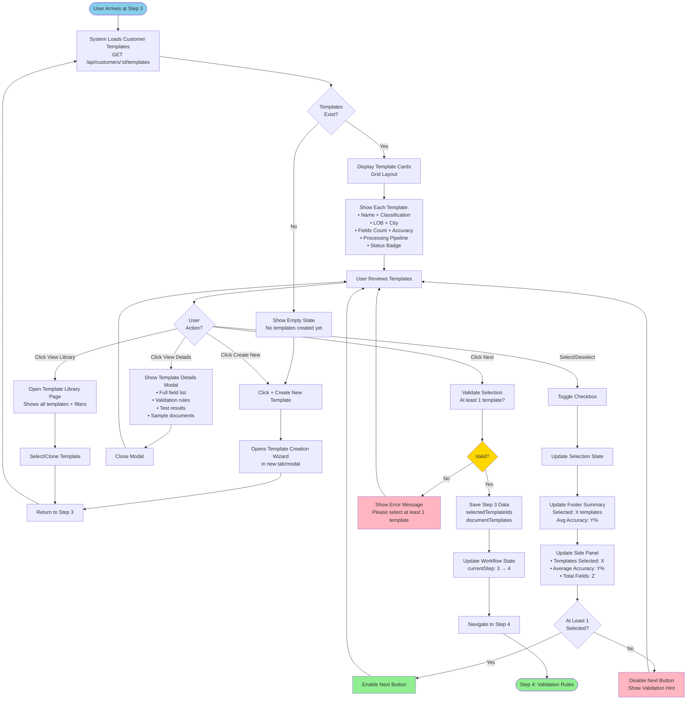

# Quick Start Wizard - Step 3 User Interaction Flow

**Purpose:** Complete user journey through Step 3 (Document Types / Template Selection) including all actions and decision points

**Related Documents:**
- [SESSION_2026-02-10_template-creation-steps3-6.md](../sessions/SESSION_2026-02-10_template-creation-steps3-6.md)
- [WIZARD_SPEC.md](../specs/WIZARD_SPEC.md#step-3-document-types)
- [Plan File](../../.claude/plans/velvety-weaving-nest.md) (Part 2, Section 2.2.1)

---

## Overview

Step 3 allows customers to select pre-created document templates for their workflow. This diagram shows all possible user actions and system responses.

**Key Feature:** Templates are pre-created by administrators via Template Creation Workflow. Customers simply select which templates to use.

---

## User Interaction Flow



---

## User Actions Explained

### 1. Select/Deselect Template
**Trigger:** Click checkbox on template card
**Effect:**
- Toggle selection state
- Update footer summary (Selected: X templates, Avg Accuracy: Y%)
- Update side panel (Templates Selected: X, Average Accuracy: Y%, Total Fields: Z)
- Enable/disable Next button based on validation

**Validation:** At least 1 template must be selected to proceed

### 2. View Template Details
**Trigger:** Click [View Details] button on template card
**Opens:** Modal dialog showing:
- Full field list (all 12 fields for Traffic Violation Type A)
- Validation rules configured for this template
- Test results history (accuracy trend over time)
- Sample documents used during creation
- Who created/approved the template and when

**Note:** Phase 2 feature (HIGH PRIORITY)

### 3. Create New Template
**Trigger:** Click [+ Create New Template] button
**Opens:** Template Creation Wizard (admin-only feature)
**Flow:**
1. Opens in new tab or modal
2. User creates template via Template Creation Workflow
3. Returns to Step 3
4. New template appears in list

### 4. View Template Library
**Trigger:** Click [View Template Library] button
**Opens:** Template Library page with:
- All available templates (including industry templates)
- Filters (LOB, City, Classification, Status)
- Sort options (Name, Accuracy, Recently updated)
- Search box
- Clone/Select actions

**Flow:**
1. User browses library
2. User selects or clones template
3. Returns to Step 3 with new selection

### 5. Click Next
**Trigger:** Click [Next →] button
**Validation:**
- Check if at least 1 template selected
- If no: Show error "Please select at least 1 template"
- If yes: Save selections, proceed to Step 4

**Data Saved:**
```typescript
{
  selectedTemplateIds: ['template-1', 'template-2', ...],
  documentTemplates: [{ id, name, lob, accuracy, ... }]
}
```

### 6. Click Back
**Trigger:** Click [← Back] button
**Effect:** Return to Step 2 (Template Selection), preserve Step 3 selections

### 7. Click Save & Exit
**Trigger:** Click [Save & Exit] button
**Effect:**
- Save current selections to localStorage
- Show toast: "Progress saved. Resume anytime from Dashboard."
- Return to Dashboard

### 8. Click Cancel
**Trigger:** Click [Cancel] button
**Dialog:** "Cancel setup? All progress will be lost."
**Options:**
- "Continue Setup" (stay on Step 3)
- "Cancel Setup" (return to Dashboard, discard all progress)

---

## Side Panel Updates

### Initial State (No Selection)
```
Templates Selected
───────────────────────────

░░░░░░░░░░░░░░░░░░░░ 0 / 30

Average Accuracy: N/A
Total Fields: 0
```

### After Selection (3 Templates)
```
Templates Selected
───────────────────────────

▓▓▓░░░░░░░░░░░░░░░░░ 3 / 30

Average Accuracy: 98.5%
Total Fields: 30

Selected:
• Traffic Violation Ticket (Type A)
• Speeding Citation (Type B)
• Parking Violation (Type C)
```

### After Selection (20 Templates)
```
Templates Selected
───────────────────────────

▓▓▓▓▓▓▓▓▓▓▓▓▓░░░░░░░░ 20 / 30

Average Accuracy: 98.9%
Total Fields: 210

Selected:
• Traffic Violation Ticket (Type A)
• Speeding Citation (Type B)
• Parking Violation (Type C)
• ... (17 more)
```

---

## Empty State Workflow

**Condition:** No templates exist for this customer

**Display:**
```
┌─────────────────────────────────────┐
│ No Templates Yet?                   │
│                                     │
│ Let's create your first one         │
│                                     │
│ [+ Create New Template]             │
│                                     │
│ Or start with an industry template: │
│ • Healthcare                        │
│ • Banking                           │
│ • Insurance                         │
│ • Police/Government                 │
└─────────────────────────────────────┘
```

**Actions:**
- Click [+ Create New Template] → Opens Template Creation Wizard
- Click industry template → Clones template for customization

---

## Validation States

### Valid State
✅ At least 1 template selected
✅ Next button enabled (primary color)

### Invalid State
❌ No templates selected
❌ Next button disabled (grayed out)
❌ Show hint: "Select at least 1 template to proceed"

---

## API Calls

### Load Templates
```
GET /api/customers/:customerId/templates
Response: DocumentTemplate[]
```

### Save Step 3
```
POST /api/wizard/save-step
Body: {
  customerId: string,
  step: 3,
  data: {
    selectedTemplateIds: string[],
    documentTemplates: DocumentTemplate[]
  }
}
```

---

## Data Structure

```typescript
interface Step3Data {
  selectedTemplateIds: string[];
  documentTemplates: DocumentTemplate[];
}

interface DocumentTemplate {
  id: string;
  name: string;  // "Traffic Violation Ticket (Type A)"
  lob: string;  // "Traffic Enforcement"
  city: string;  // "Los Angeles"
  classification: 'machine-printed' | 'handwritten' | 'mixed';
  fieldsDetected: number;  // 12
  accuracy: number;  // 98.7
  status: 'draft' | 'testing' | 'active' | 'archived';
  processingPipeline: string;  // "OCR → Extract → Validate → Export"
}
```

---

## Summary Text (for Step 7 Review)

Format: `"Types: X templates, Avg accuracy Y%"`
Example: `"Types: 20 templates, Avg accuracy 98.9%"`

---

**Last Updated:** 2026-02-10
**Related Diagrams:**
- [template-creation-high-level-flow.md](template-creation-high-level-flow.md)
- [quick-start-wizard-flow.md](quick-start-wizard-flow.md)
