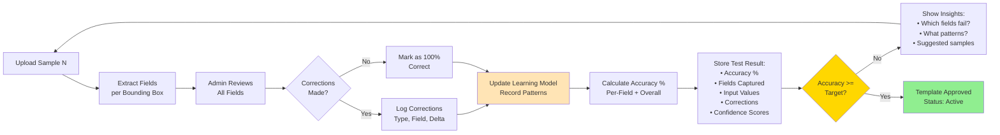

# Template Creation - Accuracy Tracking & Learning Loop

**Purpose:** Visualize the iterative accuracy improvement process with learning from corrections

**Related Documents:**
- [SESSION_2026-02-10_template-creation-steps3-6.md](../sessions/SESSION_2026-02-10_template-creation-steps3-6.md)
- [Plan File](../../.claude/plans/velvety-weaving-nest.md) (Part 1, Section 1.4)

---

## Overview

This diagram shows how the system:
1. Tests each sample document
2. Tracks corrections made by admin
3. Learns from correction patterns
4. Calculates accuracy metrics
5. Provides insights for improvement
6. Iterates until target accuracy is met

---

## Accuracy Tracking Flow



---

## Accuracy Calculation

### Formula
```
Overall Accuracy = (Correct Fields / Total Fields) × 100
```

### Per-Field Accuracy
```
Field Accuracy = (Correct Extractions / Total Extractions) × 100
```

### Example
- Sample 1: 8/10 fields correct = 80%
- Sample 2: 17/20 total correct (cumulative) = 85%
- Sample 3: 27/30 total correct = 90%
- ... continue until target met (e.g., 99.5%)

---

## Learning Model

### What Gets Tracked
1. **Correction Type**:
   - OCR_error: "O" misread as "0"
   - validation_error: Invalid zip code
   - missing_field: Field not detected
   - wrong_field: Wrong bounding box
   - formatting: "01/15/2024" vs "2024-01-15"

2. **Correction Frequency**:
   - Field X fails 40% of the time
   - Date field always has format errors

3. **Patterns Identified**:
   - "Ticket Number always starts with TKT-"
   - "Location field often includes zip code"
   - "Fine Amount usually between $10-$500"

---

## Test Result Storage

Each test sample stores:
```typescript
interface TemplateTestResult {
  id: string;
  templateId: string;
  sampleDocumentPath: string;
  uploadedBy: string;
  uploadedAt: string;

  // Extracted data per field
  extractedData: Record<string, {
    fieldId: string;
    value: string;
    confidence: number;  // OCR confidence 0-1
    validated: boolean;
    correctedValue?: string;
  }>;

  // Corrections made
  corrections: FieldCorrection[];

  // Metrics
  accuracy: number;  // Overall accuracy for this test
  passedValidation: boolean;
  processingTime: number;  // Seconds

  // Status
  status: 'pending' | 'reviewed' | 'approved' | 'failed';
}
```

---

## Insights Provided

When accuracy < target, system shows:

### 1. Failing Fields
```
Top 3 Fields with Errors:
1. Date (40% error rate) - Format inconsistency
2. Ticket Number (25% error rate) - OCR misreads prefix
3. Location (20% error rate) - Missing zip code validation
```

### 2. Common Patterns
```
Identified Patterns:
• "O" frequently misread as "0" (3 occurrences)
• Date format varies (MM/DD/YYYY vs YYYY-MM-DD)
• Zip codes in "Location" field not always detected
```

### 3. Suggested Samples
```
Recommended Next Samples:
✓ Upload document with clear date field
✓ Upload document with distinct "O" vs "0" characters
✓ Upload document with zip code in different position
```

---

## Accuracy Trend Example

```
Sample 1:  80% ████████░░
Sample 2:  85% █████████░
Sample 3:  90% █████████░
Sample 4:  95% ██████████
Sample 5:  98% ██████████
Sample 6:  99.2% ██████████
Sample 7:  99.5% ██████████  ← Target Met!
```

---

## Success Criteria

Template approved when:
- ✅ Overall accuracy ≥ target (e.g., 99.5%)
- ✅ Per-field accuracy acceptable (no field < 95%)
- ✅ Minimum sample count met (e.g., 5 samples)
- ✅ External validation configured (if applicable)

---

**Last Updated:** 2026-02-10
**Related Diagrams:**
- [template-creation-high-level-flow.md](template-creation-high-level-flow.md)
- [template-field-detection-sequence.md](template-field-detection-sequence.md)
- [template-external-validation-flow.md](template-external-validation-flow.md)
