# Template Creation - High-Level Flow

**Purpose:** Visualize the complete template creation and testing workflow from customer document submission to approved template

**Related Documents:**
- [SESSION_2026-02-10_template-creation-steps3-6.md](../sessions/SESSION_2026-02-10_template-creation-steps3-6.md)
- [Plan File](../../.claude/plans/velvety-weaving-nest.md) (Part 1)

---

## Participants

- **Customer**: Provides sample documents, reviews results, sets expectations
- **Administrator**: Uploads samples, configures fields, corrects errors, approves template
- **System**: OCR engine, field detection, validation, accuracy calculation, learning model

---

## Process Flow

```mermaid
flowchart TD
    Start([Customer Shares Document Types]) --> Select[Admin Selects Classification:<br/>Machine Printed / Handwritten / Mixed]
    Select --> Upload1[Admin Uploads First Sample]
    Upload1 --> Scan1[System Scans & Identifies Fields<br/>OCR + Layout Analysis]
    Scan1 --> Review1[Admin Reviews & Confirms Fields]
    Review1 --> Decision1{Corrections<br/>Needed?}
    Decision1 -->|Yes| Upload1
    Decision1 -->|No| Upload2[Admin Uploads Second Sample<br/>for Data Extraction]

    Upload2 --> Scan2[System Extracts Data from Fields<br/>OCR per Field + Confidence]
    Scan2 --> ExternalVal[System Validates External Fields<br/>Query RAG for zip codes, country codes]
    ExternalVal --> Mark[Admin Marks/Confirms Field Data]
    Mark --> Review2[Admin Reviews Extracted Data<br/>Per-Field Review]
    Review2 --> Correct{Corrections<br/>Needed?}

    Correct -->|Yes| LogChanges[System Logs Corrections<br/>Field, Expected, Extracted, Delta]
    Correct -->|No| CheckAccuracy
    LogChanges --> CheckAccuracy[Calculate Accuracy %<br/>Per-Field & Overall]
    CheckAccuracy --> StoreResult[Store Test Result<br/>Accuracy, Confidence, Corrections]

    StoreResult --> Decision2{More Samples<br/>Needed?}
    Decision2 -->|Yes| Upload2
    Decision2 -->|No| SetTarget[Admin Sets Target Accuracy Rate<br/>e.g., 99.5%]
    SetTarget --> Decision3{Target<br/>Met?}
    Decision3 -->|No| Upload2
    Decision3 -->|Yes| SaveTemplate[Save Approved Template<br/>Status: Active]
    SaveTemplate --> End([Template Ready for Quick Start Wizard])

    style SaveTemplate fill:#90EE90
    style Decision3 fill:#FFD700
    style CheckAccuracy fill:#87CEEB
```

---

## Key Phases

### Phase 1: Field Identification
1. Admin uploads first sample document
2. System scans and identifies field boundaries via OCR + layout analysis
3. Admin reviews and corrects field definitions
4. Iterate until fields are correctly identified

### Phase 2: Data Extraction & Testing
5. Admin uploads additional samples for testing
6. System extracts data from each field
7. System validates external fields (zip codes, country codes) via RAG
8. Admin reviews extracted data per field
9. Admin corrects any errors
10. System logs all corrections

### Phase 3: Accuracy Tracking & Approval
11. System calculates accuracy % (per-field + overall)
12. System stores test results
13. Admin uploads more samples if accuracy < target
14. Admin sets target accuracy rate (e.g., 99.5%)
15. Once target met, admin approves template
16. Template status = Active, ready for Quick Start Wizard

---

## Success Criteria

- ✅ All fields correctly identified with bounding boxes
- ✅ Accuracy meets or exceeds target (e.g., 99.5%)
- ✅ External validation configured for applicable fields
- ✅ Template approved by administrator
- ✅ Status set to "Active"

---

**Last Updated:** 2026-02-10
**Related Diagrams:**
- [template-field-detection-sequence.md](template-field-detection-sequence.md)
- [template-accuracy-tracking-flow.md](template-accuracy-tracking-flow.md)
- [template-external-validation-flow.md](template-external-validation-flow.md)
