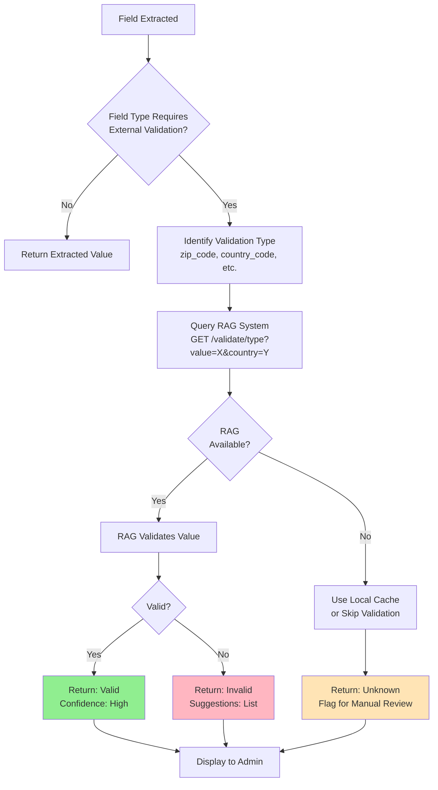

# Template Creation - External Validation (RAG Integration)

**Purpose:** Show how external validation works via Reference Augmented Generation (RAG) for data quality checks

**Related Documents:**
- [SESSION_2026-02-10_template-creation-steps3-6.md](../sessions/SESSION_2026-02-10_template-creation-steps3-6.md)
- [Plan File](../../.claude/plans/velvety-weaving-nest.md) (Part 1, Section 1.5)
- [Specs: FR-024 Shared Reference Data](../../specs/)

---

## Overview

External validation queries reference databases to verify extracted field values against known valid data (e.g., postal codes, country codes, state codes).

**Benefits:**
- Catch OCR errors early
- Reduce manual review burden
- Improve data quality
- Provide correction suggestions

---

## External Validation Flow



---

## Supported Validation Types

### 1. Zip Code / Postal Code
```
Validation Type: zip_code
Query: GET /api/validate/zip_code?value=90210&country=US
Response:
{
  "isValid": true,
  "suggestions": [],
  "metadata": {
    "city": "Beverly Hills",
    "state": "CA",
    "country": "US"
  }
}
```

### 2. Country Code
```
Validation Type: country_code
Query: GET /api/validate/country_code?value=US
Response:
{
  "isValid": true,
  "suggestions": [],
  "metadata": {
    "name": "United States",
    "iso2": "US",
    "iso3": "USA"
  }
}
```

### 3. State Code
```
Validation Type: state_code
Query: GET /api/validate/state_code?value=CA&country=US
Response:
{
  "isValid": true,
  "suggestions": [],
  "metadata": {
    "name": "California",
    "abbreviation": "CA"
  }
}
```

### 4. Custom Validation
```
Validation Type: custom
Query: GET /api/validate/custom?type=ticket_prefix&value=TKT
Response:
{
  "isValid": true,
  "suggestions": ["TKT-", "TICKET-"],
  "metadata": {}
}
```

---

## RAG Integration Options

### Option 1: SQLite Lookup Tables (MVP)
**Pros:**
- Simple to implement
- Fast lookups
- No external dependencies
- Easy to update

**Cons:**
- Limited to pre-defined lists
- No semantic search
- Manual updates required

**Implementation:**
```sql
CREATE TABLE zip_codes (
  zip TEXT PRIMARY KEY,
  city TEXT,
  state TEXT,
  country TEXT
);

CREATE TABLE country_codes (
  iso2 TEXT PRIMARY KEY,
  iso3 TEXT,
  name TEXT
);
```

### Option 2: Vector Store + RAG (Production)
**Pros:**
- Semantic search
- Fuzzy matching
- Contextual validation
- Self-learning

**Cons:**
- More complex setup
- External dependencies
- Higher cost

**Options:**
- LlamaIndex + local vector store
- LangChain + Pinecone
- Custom REST API

---

## Fallback Behavior

### When RAG is Unavailable

**Scenario 1: RAG Service Down**
```
1. Check local cache for recently validated values
2. If found → use cached result (mark as "stale")
3. If not found → skip validation, flag for manual review
4. Log failure for monitoring
```

**Scenario 2: RAG Response Timeout**
```
1. Retry with exponential backoff (2s, 4s, 8s)
2. After 3 retries → fallback to local cache
3. Log timeout for investigation
```

**Scenario 3: Unknown Validation Type**
```
1. Skip validation
2. Flag field for manual review
3. Log as warning (possible misconfiguration)
```

---

## Validation Result Handling

### Valid Result
```typescript
{
  isValid: true,
  suggestions: [],
  metadata: { ... }
}
```
**Action:** Mark field as validated, no action needed

### Invalid Result with Suggestions
```typescript
{
  isValid: false,
  suggestions: ["90210", "90211", "90212"],
  metadata: {}
}
```
**Action:**
1. Flag field for review
2. Show suggestions to admin
3. Admin can select suggestion or correct manually

### Unknown Result (Fallback)
```typescript
{
  isValid: null,
  suggestions: [],
  metadata: { source: "local_cache_stale" }
}
```
**Action:**
1. Flag field for manual review
2. Show warning: "⚠ External validation unavailable"
3. Admin must verify manually

---

## Example: Zip Code Validation

### Extracted Value: "90210"

**Step 1:** Check if field type requires external validation
- Field type: "text"
- Field name: "Location"
- External validation: enabled (zip_code)

**Step 2:** Query RAG
```
GET /api/validate/zip_code?value=90210&country=US
```

**Step 3:** RAG Response
```json
{
  "isValid": true,
  "suggestions": [],
  "metadata": {
    "city": "Beverly Hills",
    "state": "CA",
    "country": "US"
  }
}
```

**Step 4:** Display to Admin
```
Location: 90210 ✓ Valid
  └─ Beverly Hills, CA, US
```

### Extracted Value: "99999" (Invalid)

**Step 1-2:** Same as above

**Step 3:** RAG Response
```json
{
  "isValid": false,
  "suggestions": ["90001", "90002", "90210"],
  "metadata": {}
}
```

**Step 4:** Display to Admin
```
Location: 99999 ✗ Invalid
  └─ Did you mean: 90001, 90002, 90210?
  └─ [Correct Value] ___________
```

---

## API Endpoint Specification

```typescript
// External Validation Endpoint
POST /api/validate/:type
Query params:
  - value: string (required) - Value to validate
  - country: string (optional) - Country context (for zip codes, state codes)

Response:
{
  isValid: boolean,
  suggestions?: string[],
  metadata?: Record<string, any>,
  source: 'rag' | 'local_cache' | 'skipped'
}
```

---

## Configuration

### Per-Field External Validation Config
```typescript
interface ExternalValidationConfig {
  fieldId: string;
  fieldName: string;
  validationType: 'zip_code' | 'country_code' | 'state_code' | 'custom';
  enabled: boolean;
  customQuery?: string;  // For 'custom' type
}
```

### Global RAG Settings
```typescript
interface RAGSettings {
  enabled: boolean;
  endpoint: string;  // Default: internal RAG service
  timeout: number;  // Default: 5000ms
  retries: number;  // Default: 3
  fallbackToCache: boolean;  // Default: true
}
```

---

**Last Updated:** 2026-02-10
**Related Diagrams:**
- [template-creation-high-level-flow.md](template-creation-high-level-flow.md)
- [template-field-detection-sequence.md](template-field-detection-sequence.md)
- [template-accuracy-tracking-flow.md](template-accuracy-tracking-flow.md)
