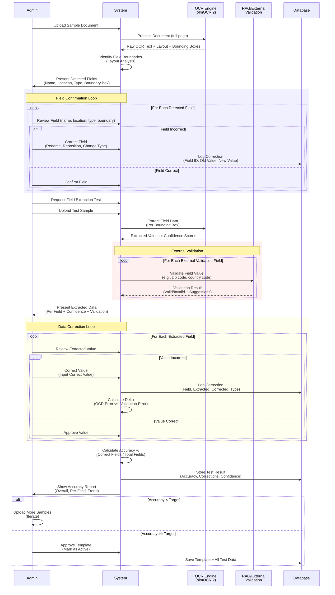

# Template Creation - Field Detection & Correction Sequence

**Purpose:** Detailed sequence diagram showing field identification loop and data extraction with external validation

**Related Documents:**
- [SESSION_2026-02-10_template-creation-steps3-6.md](../sessions/SESSION_2026-02-10_template-creation-steps3-6.md)
- [Plan File](../../.claude/plans/velvety-weaving-nest.md) (Part 1, Section 1.3)

---

## Participants

- **Admin**: Administrator creating and testing template
- **System**: Template creation application
- **OCR Engine**: olmOCR 2 (or other OCR service)
- **RAG**: Reference Augmented Generation for external validation
- **Database**: Stores templates, corrections, test results

---

## Sequence Diagram

---

## Key Interactions

### Field Identification Phase
1. **Upload & Scan**: Admin uploads sample, system processes with OCR
2. **Field Detection**: System identifies field boundaries via layout analysis
3. **Field Confirmation**: Admin reviews each field, corrects if needed
4. **Correction Logging**: All corrections logged for learning

### Data Extraction Phase
5. **Extract**: System extracts data per field using bounding boxes
6. **External Validation**: System validates applicable fields via RAG (zip codes, etc.)
7. **Review & Correct**: Admin reviews extracted values, corrects errors
8. **Accuracy Calculation**: System calculates per-field and overall accuracy

### Approval Phase
9. **Accuracy Check**: If accuracy < target → upload more samples
10. **Approval**: Once accuracy ≥ target → admin approves template
11. **Storage**: Save template with all test data and corrections

---

## External Validation Types

Supported via RAG:
- **zip_code**: Validate against postal code databases
- **country_code**: Validate against ISO country codes
- **state_code**: Validate against US state codes
- **custom**: Custom validation queries

---

## Correction Types Tracked

- **OCR_error**: OCR misread the value
- **validation_error**: Value failed external validation
- **missing_field**: Field not detected
- **wrong_field**: Wrong bounding box
- **formatting**: Correct value, wrong format

---

**Last Updated:** 2026-02-10
**Related Diagrams:**
- [template-creation-high-level-flow.md](template-creation-high-level-flow.md)
- [template-accuracy-tracking-flow.md](template-accuracy-tracking-flow.md)
- [template-external-validation-flow.md](template-external-validation-flow.md)
